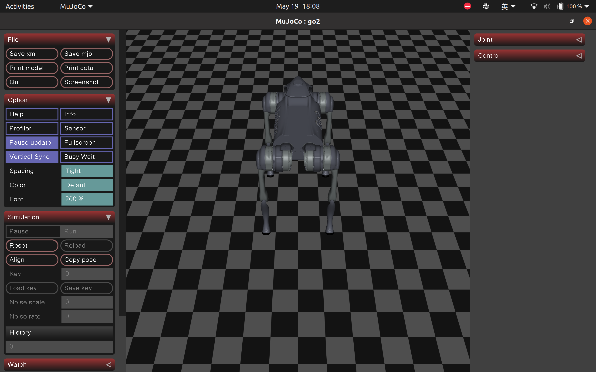

# Deploy-an-RL-policy-on-the-Unitree-Go2-robot
> 对 Isaac Lab 新训练策略，请使用 `deploy_isaaclab.py` 和 `src/deploy_rl_policy/configs/go2_isaaclab*.yaml`。该入口要求策略旁存在导出生成的 JSON 契约，并在发布电机目标前校验关节顺序、观测维度和动作维度。

This repository provides a framework for low-level control of a legged robot (Unitree Go2), using ROS 2 as the communication middleware. The MuJoCo simulator is used to validate the control policy in simulation. Once the policy performs well in MuJoCo, you can deploy it on the real robot by simply setting the ROS parameter is_simulation to false. Also a base velocity estimator using extended Karman Filter is provided to estimate the velocity of base. If you find this project useful, please consider giving it a ⭐️ to support development!


## Environment
- **Ubuntu**: 20.04/22.04
- **ROS 2**: Foxy/Humble
- **MuJoCo**: 3.2.3
- **Python**: 3.8.20/3.10
- **Pinocchio**: 3.4.0

## Access Robot Sensor Data via ROS 2
Refer to the official Unitree ROS 2 repository for setup and examples:
[unitree ros2](https://github.com/unitreerobotics/unitree_ros2)

*source unitree_ros2 before building this workspace*

### Potential Build Issue
When building the ROS 2 packages, you may encounter the following error:
```bash
ModuleNotFoundError: No module named 'unitree_go.unitree_go_s__rosidl_typesupport_c’
```
or 
``` bash
rosidl_generator_py.import_type_support_impl.UnsupportedTypeSupport: Could not import 'rosidl_typesupport_c' for package 'unitree_go’
```
This issue occurs because **ROS 2 Foxy supports only Python 3.8** for generating C-based type support modules. If a different Python version is used, the build process may still succeed, but the runtime will **fail to locate the generated files**, resulting in import errors when executing ROS 2 commands.

### Solution
Manually set your Python version to **3.8** when building the workspace. For example:
```bash
export PYTHON_EXECUTABLE=/usr/bin/python3.8
colcon build --symlink-install
```
Make sure Python 3.8 is installed and available at the specified path.


## Simulation
After successfully building this workspace, you can launch the simulation in mujoco with the following commands:
```bash
source install/setup.bash
ros2 run deploy_rl_policy mujoco_simulator.py
``` 
Here is a screenshot of the simulation scene:
<p align="center">
  
</p>

## Control Logic
The robot's behavior is controlled by a 3-state state machine, including:
* **Laying Down**
* **Standing Up**
* **Executing RL Policy**

### State Transition (XBox Controller)
* **Initial State:** Robot automatically enters "Laying Down" state
* **B Button:** Transitions from "Laying Down" → "Standing Up"
* **A Button:** Transitions from "Standing Up" → "Laying Down"
* **LB + RB Simultaneously:** While standing, executes RL Policy (remains in standing state)

### State Transition (Keyboard, no gamepad required)
`keyboard_command.py` publishes the same `sensor_msgs/Joy` messages on `/joy`, so it is a
drop-in replacement for `joy_node` and nothing downstream changes.

| Key | Emulates | Effect |
| --- | --- | --- |
| `q` | X / A button | Lay down |
| `e` | O / B button | Stand up |
| `r` | Triangle | Select the canter skill |
| `c` | LB + RB | **Toggle**: press once to activate the policy and enable the sticks, press again to release |
| `w` / `s` | Left stick vertical | Forward / backward |
| `a` / `d` | Left stick horizontal | Left / right |
| arrow keys | Right stick | Yaw on left/right |
| `space` | — | Centre every stick |
| `x` | L2 + R2 | Ask `low_level_ctrl` to shut down |
| `?` or `h` | — | Reprint the key map |

Because the physical gamepad shares these buttons, `q` also selects the *pace* skill and
`e` also selects *trot*, exactly as on the real controller.

Stick behaviour is selected with `--stick-mode`:
* `latch` (default) — a direction key stays applied until the same key is pressed again,
  the opposite key is pressed, or `space` centres it. Independent of terminal key-repeat.
* `hold` — the direction applies while the terminal auto-repeats the key and decays
  `--hold-timeout` seconds after the last repeat, closer to a spring-return stick.

The `c` toggle exists because the gamepad workflow requires LB+RB to be *held* for the
whole run; latching them removes the need to hold two keys down.
Releasing the latch stops the direction command but does **not** stop the policy —
press `q` to lay the robot back down.

**The node needs a real terminal.** Run it directly in a terminal window, not through a
pipe, a launch file, or `nohup`.

### Notes:
* The "Executing RL Policy" state is considered a special case of the "Standing Up" state
* Controller inputs are only processed when the robot is in the appropriate state for that transition

### Launch Control Nodes
**Remember to turn down the *sport mode* service of the robot before deploying the policy on real robot!**

Run the following commands in separate terminals to activate the control system:

```bash
# Terminal 1: XBox Controller Interface
ros2 run joy joy_node
# ...or, with no gamepad, the keyboard bridge (must run in a real terminal):
ros2 run deploy_rl_policy keyboard_command.py

# Terminal 2: State Machine Controller
ros2 run deploy_rl_policy low_level_ctrl --ros-args -p is_simulation:=true # true: simulation  false: real robot

# Terminal 3: Reinforcement Learning Policy
ros2 run deploy_rl_policy rl_policy.py --is_simulation True  # or False
```
Node Description:
1. joy_node *or* keyboard_command.py
    * Interfaces with XBox controller hardware, or turns key presses into the same messages
    * Publishes controller input to /joy topic
2. low_level_control
    * Implements the 3-state machine (Laying Down/Standing Up/RL Policy)
    * Handles state transitions based on controller input
    * Sends lowcmd to simulator or the real robot
3. ​​RL_policy.py​​:
    * Executes reinforcement learning policy
    * Activated only in "Executing RL Policy" state (LB+RB pressed while standing)

## Implementing Custom Policies

To use your own reinforcement learning policy with the system:

1. **Modify Policy Path**  
   Edit the policy file path in `rl_policy.py` to point to your custom policy.

2. **Data Sequence Considerations**  
   - The Unitree robot uses a specific joint order that may differ from your training environment
   - Verify your policy's output sequence matches the robot's expected input order

3. **Safety Recommendations**  
   ```diff
   + Always test new policies in simulation first
   - Avoid deploying untested policies directly to hardware
   ```
You can refer to the [official documentation](https://support.unitree.com/home/en/developer/Basic_services) to check the correct joint order.

## Base Velocity Estimator
If your policy requires the base velocity as part of the observation and it's not available from onboard sensors, you can use the **Base Velocity Estimator** to estimate it.

It's implemented as an **Extended Kalman Filter (EKF)** with a measurement model and a system model. The measurement is computed from kinematic equations using [Pinocchio](https://github.com/stack-of-tasks/pinocchio). Here's a rough overview of the theory behind it:
[https://glowing-torch.github.io/Deploy-an-RL-policy-on-the-Unitree-Go2-robot/](https://glowing-torch.github.io/Deploy-an-RL-policy-on-the-Unitree-Go2-robot/).
